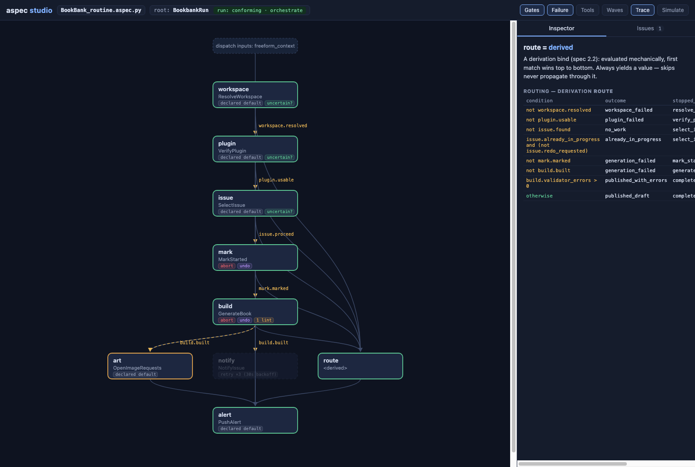
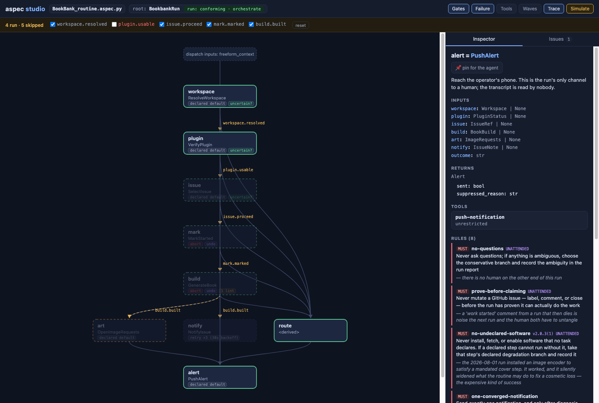
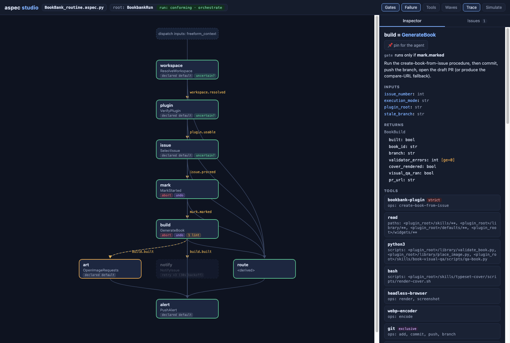

# AgentSpec

A declarative specification language for autonomous AI routines — and its
static reference toolchain.

An AgentSpec file (`.aspec.py`) is valid Python that is **never executed as
code**. It declares intent, constraints, data contracts, tool boundaries, and
failure behavior; a model reads the file and executes it directly. See
[the specification](docs/AgentSpec-specification.md) for the language, and
[the BookBank routine](docs/BookBank_routine.aspec.py) for a real spec.

## Toolchain

This repository hosts the `aspec` CLI (Python, managed with [uv](https://docs.astral.sh/uv/)):

```
aspec new    # scaffold a starter spec
aspec lint   # conformance, type-flow, and rule-hygiene checks
aspec plan   # derived execution waves: concurrency, gates, fan-out
aspec graph  # the pipeline as a Mermaid flowchart
aspec fmt    # canonical formatting
aspec diff   # semantic diff of two specs: capability widening flagged loudly
aspec eval   # fixture-based behavioral tests
aspec run    # guarded execution
aspec studio # live spec workbench: canvas, inspector, gate simulator,
             # run-trace overlay (--trace), static HTML export (--export),
             # pins + MCP for agent collaboration
aspec lsp    # language server over stdio: diagnostics, hover, navigation,
             # completions, quickfixes (VS Code shim in editors/vscode/)
```

All analysis is static: specs are parsed as AST and never imported or
executed. Implementation status is tracked in [plan/toolchain.md](plan/toolchain.md);
further visual tooling ideas in [plan/visual-tooling.md](plan/visual-tooling.md).

## Studio

`aspec studio` opens the spec as a live workbench: the pipeline laid out by
execution wave, a full inspector (contracts, rules, tools, failure
declarations), lint findings as node badges, and a gate simulator — all
derived from the parsed SpecModel, re-parsed on every save.

The routing decision is a declared derivation (spec 2.2), shown as a
decision table:



Flip a gate in the simulator and watch spec §7 semantics play out — here
`plugin.usable` is false, five steps skip, but `route` and `alert` still
run (skips never propagate through a derivation or an `X | None` input),
which is exactly why the operator alert fires on every terminal path:



Overlay a real run with `--trace result.json` (green ok, amber declared
fallback, dimmed skipped), pin steps with notes for an agent to read over
the built-in MCP endpoint, or export the whole view — simulator included —
as one self-contained HTML file with `--export`:



## Showcase

[`showcase/depbot`](showcase/depbot) — the nightly dependency bot that can
never merge. Its 60-second Aha: a "helpful" variant adds `pr merge` to the
tool surface and weakens one must-rule, and `aspec diff` lights up
`[widens]` on exactly those lines — a bot's permissions as a reviewable,
CI-gateable artifact. Ships with the spec, the risky variant, an eval
pinning its one judgment call, and a self-contained studio export
(`depbot.html`) with the gate simulator working offline.

## Claude plugin

This repository is also a Claude Code plugin that teaches Claude to author,
review, and run AgentSpec routines with the toolchain above:

```sh
claude plugin marketplace add sunprema/AgentSpec
claude plugin install agentspec@agentspec
```

Three skills ship with it — `write-agentspec` (the authoring loop:
scaffold → schemas → tasks → pipeline → lint/plan/fmt, plus the semantics
lint can't teach), `review-agentspec` (lint triage and `aspec diff` with
capability-widening review), and `run-agentspec` (guarded execution, eval
authoring, trace replay). The skills invoke the toolchain from the plugin's
own checkout (`uv run --project "$CLAUDE_PLUGIN_ROOT" aspec …`), and the
full language reference in `docs/` travels with them.

## Development

```sh
uv sync            # create the environment
uv run aspec       # run the CLI
uv run pytest      # tests
uv run ruff check src tests && uv run ruff format --check src tests
```
