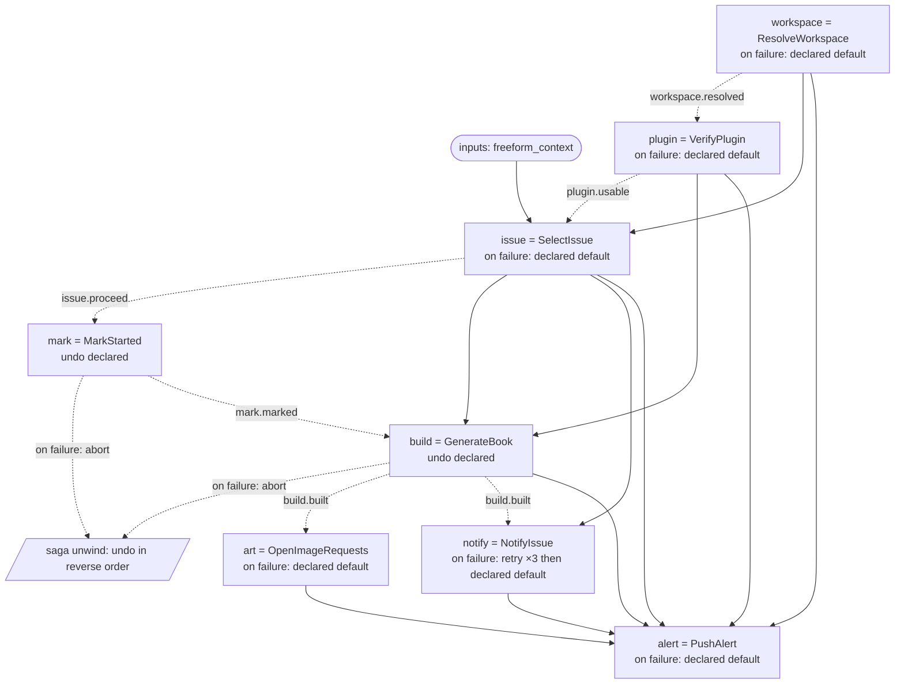

# Execution graph — BookBank_routine.aspec.py

## BookbankRun

```mermaid
flowchart TD
    _inputs(["inputs: freeform_context"])
    workspace["workspace = ResolveWorkspace<br/>on failure: declared default"]
    plugin["plugin = VerifyPlugin<br/>on failure: declared default"]
    issue["issue = SelectIssue<br/>on failure: declared default"]
    mark["mark = MarkStarted<br/>undo declared"]
    build["build = GenerateBook<br/>undo declared"]
    art["art = OpenImageRequests<br/>on failure: declared default"]
    notify["notify = NotifyIssue<br/>on failure: retry ×3 then declared default"]
    alert["alert = PushAlert<br/>on failure: declared default"]
    workspace -. "workspace.resolved" .-> plugin
    _inputs --> issue
    plugin -. "plugin.usable" .-> issue
    workspace --> issue
    issue -. "issue.proceed" .-> mark
    mark -. "on failure: abort" .-> _unwind
    issue --> build
    mark -. "mark.marked" .-> build
    plugin --> build
    build -. "on failure: abort" .-> _unwind
    build -. "build.built" .-> art
    build -. "build.built" .-> notify
    issue --> notify
    art --> alert
    build --> alert
    issue --> alert
    notify --> alert
    plugin --> alert
    workspace --> alert
    _unwind[/"saga unwind: undo in reverse order"/]
```
